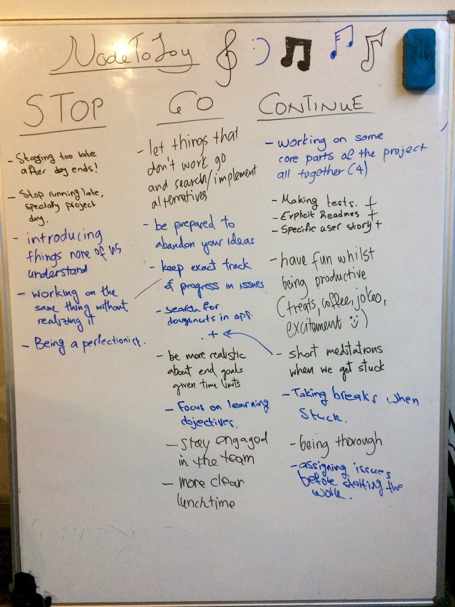

# stop-go-continue
Team stop-go-continue sessions

## Week 6

Most important points:
- GO: Be prepared to abandon your ideas
- GO: Keep better track of progress
- GO: Be more realistic about end goals
- STOP: Running late

